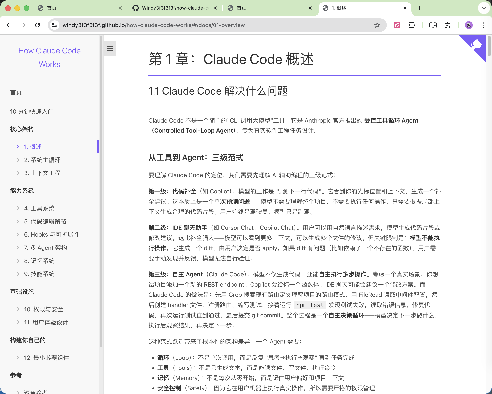
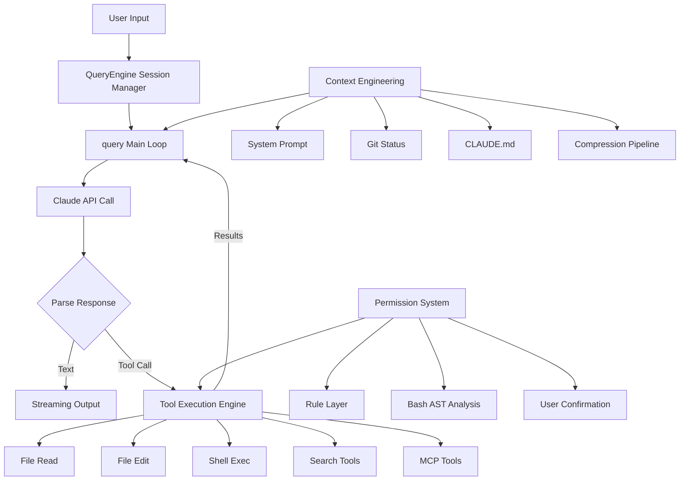

# How Claude Code Works

> A deep dive into the source code architecture of the most successful AI coding agent

  <a href="https://windy3f3f3f3f.github.io/how-claude-code-works/#/"><strong>📘 Read Online →</strong></a>
  &nbsp;&nbsp;|&nbsp;&nbsp;
  <a href="./README.md">中文</a>

> 🛠️ **Want to build one yourself?** Companion project **[Claude Code From Scratch](https://github.com/Windy3f3f3f3f/claude-code-from-scratch)** — 1300 lines of TypeScript, 8-chapter step-by-step tutorial, build your own Claude Code from zero

---

Claude Code is the most widely used AI coding agent today. It understands entire codebases, autonomously executes multi-step programming tasks, and safely runs commands — all powered by engineering wisdom distilled into **500K+ lines of TypeScript source code**.

Anthropic open-sourced this codebase. **But where do you even start with 500K lines of code?**

This project is the answer. We've distilled **12 topic-specific documents** (338K characters total) covering every critical design decision, from the core agent loop to the security architecture. Whether you want to build your own AI agent or deeply understand how Claude Code works, this is the shortest path.

## System Architecture

## Why is this source code worth studying?

Most AI agent frameworks are "demo-grade" — they work for one scenario and call it done. Claude Code is different. It's a **production system used daily by millions of developers**, tackling problems far more complex than any demo:

- Conversations grow to tens of thousands of tokens — what happens when the context window runs out?
- A user asks the AI to run `rm -rf /` — how do you stop it?
- 66 built-in tools coexist — how do you coordinate them?
- Network drops, API overloads, token limits hit — how do you avoid crashing?
- How do you make it *feel* fast when model inference alone takes tens of seconds?

The answers are all in the source code.

## Key Designs from the Source Code

> Everything below comes from actual source code analysis, not speculation.

### Why does Claude Code feel so fast?

It does three clever things:

1. **End-to-end streaming** — Instead of waiting for the model to finish thinking, every token is displayed the instant it's generated. The entire pipeline from API call to terminal rendering is streaming.
2. **Tool pre-execution** — When the model says "I need to read this file," that file is already being read. The system parses and executes tool calls while the model is still generating output, hiding ~1s of tool latency within the 5-30s model generation window.
3. **9-phase parallel startup** — Independent initialization tasks run in parallel, compressing the critical path to ~235ms.

### What happens when things go wrong? — Silent recovery

Most programs show errors to users. Claude Code's strategy: **if an error is recoverable, the user never sees it.**

When a conversation exceeds the context window, it doesn't pop up an error dialog — it silently compresses the context and retries. Hit the output token limit? It automatically escalates from 4K to 64K and tries again. The agent loop has 7 different "continue" strategies, each handling a different failure recovery path.

This is why you rarely see errors in Claude Code — not because there aren't any, but because most are handled internally.

### What about long conversations? — 4-level progressive compression

One of the most elegant designs in the entire system. When context approaches its limit, instead of a blunt compression pass, it goes through 4 graduated levels:

1. **Snip** — Truncate large content blocks (old tool outputs) from history
2. **Deduplicate** — Remove duplicate content at near-zero cost
3. **Collapse** — Fold inactive conversation segments without modifying originals (reversible)
4. **Summarize** — Last resort: spawn a child agent to summarize the entire conversation

Each level may free enough space that subsequent levels don't need to run. After compression, the system **automatically restores the 5 most recently edited files**, preventing the model from forgetting what it was just working on.

### How do you prevent AI from executing dangerous operations? — 5 layers of defense

Claude Code runs commands directly on your machine — security has to be rock-solid. It doesn't rely on a single "are you sure?" dialog. Instead, it builds 5 layers of defense:

1. **Permission modes** — Different trust levels restricting what operations can run
2. **Rule matching** — Pattern-based allowlists and denylists
3. **Deep Bash analysis** — The most hardcore layer: uses syntax tree analysis (not regex) to dissect the true intent of shell commands, with 23 security checks covering command injection, environment variable leaks, special character attacks, and more
4. **User confirmation** — Dangerous operations trigger a confirmation dialog with 200ms debounce protection against accidental key presses
5. **Hook validation** — Users can define custom security rules that even modify tool inputs on the fly (e.g., automatically adding `--dry-run` to `rm` commands)

If any single layer blocks the action, it doesn't execute. Defense in depth.

### How do 66 tools work together?

All tools — file reading, file writing, shell commands, search, even third-party MCP tools — follow **the same interface specification**. This means:

- Third-party tools go through the exact same execution pipeline as built-in tools, getting identical security checks and permission controls
- Read-only tools automatically run in parallel; write operations are serialized — no manual concurrency management needed
- When tool output exceeds 100K characters, it's automatically saved to disk; the model gets a summary and file path, reading the full content on demand

### How do multiple agents collaborate?

Claude Code supports three multi-agent modes:

- **Sub-agent** — The main agent dispatches tasks to child agents and waits for results
- **Coordinator** — Pure commander mode: the coordinator can only assign tasks, **it cannot read files or write code itself**, enforcing division of labor
- **Swarm** — Named agents communicate peer-to-peer, each working independently

To prevent conflicts from multiple agents editing the same files, the system uses Git Worktrees to give each agent its own isolated copy of the codebase.

## Documentation

### Quick Start
- **[Understand Claude Code in 10 Minutes](./docs/quick-start.md)** — Condensed overview of everything

### Deep Dives

| # | Document | What you'll learn |
|---|----------|-------------------|
| 1 | [Overview](./docs/01-overview.md) | What problem Claude Code solves, the thinking behind tech choices, overall architecture |
| 2 | [Agent Loop](./docs/02-agent-loop.md) | How the agent "think-act-observe" loop works, how it handles interruption and recovery |
| 3 | [Context Engineering](./docs/03-context-engineering.md) | How to fit the most useful information into a limited context window, full compression strategy details |
| 4 | [Tool System](./docs/04-tool-system.md) | How 66 tools are registered, dispatched, and concurrency-controlled; how to integrate third-party tools |
| 5 | [Code Editing Strategy](./docs/05-code-editing-strategy.md) | Why "search-and-replace" over "full file rewrite," how to ensure edit safety |
| 6 | [Hooks & Extensibility](./docs/06-hooks-extensibility.md) | 23 hook events, how to customize Claude Code's behavior without modifying source code |
| 7 | [Multi-Agent Architecture](./docs/07-multi-agent.md) | Sub-agent, Coordinator, and Swarm — design tradeoffs of three multi-agent modes |
| 8 | [Memory System](./docs/08-memory-system.md) | 4 memory types, Sonnet semantic recall, background extraction agent, drift defense |
| 9 | [Skills System](./docs/09-skills-system.md) | 6 skill sources, lazy loading, inline/fork execution, permission model, post-compaction preservation |
| 10 | [Permission & Security](./docs/10-permission-security.md) | The complete 5-layer security system, 23 Bash security checks |
| 11 | [User Experience](./docs/11-user-experience.md) | Why React for terminal UI, streaming output implementation, terminal interaction details |
| 12 | [Minimal Components](./docs/12-minimal-components.md) | The minimum modules needed for a coding agent, the evolution path from 500 lines to 500K |

## Who should read this?

| You are | What you'll get |
|---------|----------------|
| A developer building AI agent products | A battle-tested architecture reference validated by millions of users |
| A Claude Code user | Understanding of why it works the way it does, and how to deeply customize it with Hooks and CLAUDE.md |
| Someone interested in AI safety | Production-grade AI security design in practice, not just theory from papers |
| A student or AI researcher | First-hand material on large-scale engineering practice, more real than any textbook |

## Key Stats

| Metric | Value |
|--------|-------|
| Source lines | 512,000+ |
| TypeScript files | 1,884 |
| Built-in tools | 66+ |
| Compression levels | 4 |
| Security layers | 5 |

## Reading Recommendations

**Only have 10 minutes?**
→ Read [Quick Start](./docs/quick-start.md)

**Want to understand core principles?**
→ Read in order: [Agent Loop](./docs/02-agent-loop.md) → [Context Engineering](./docs/03-context-engineering.md) → [Tool System](./docs/04-tool-system.md)

**Want to build your own AI agent?**
→ Start with [Minimal Components](./docs/12-minimal-components.md), then follow **[claude-code-from-scratch](https://github.com/Windy3f3f3f3f/claude-code-from-scratch)** — 8-chapter hands-on tutorial, 1300 lines of code, every step mapped to the real source

**Want to customize Claude Code?**
→ Read [Hooks & Extensibility](./docs/06-hooks-extensibility.md) + [Memory System](./docs/08-memory-system.md) + [Skills System](./docs/09-skills-system.md)

**Care about security?**
→ Read [Permission & Security](./docs/10-permission-security.md) + [Code Editing Strategy](./docs/05-code-editing-strategy.md)

## Contributing

Issues and PRs welcome! If you find an error in the analysis or have a better perspective, we'd love to discuss.

## License

MIT
